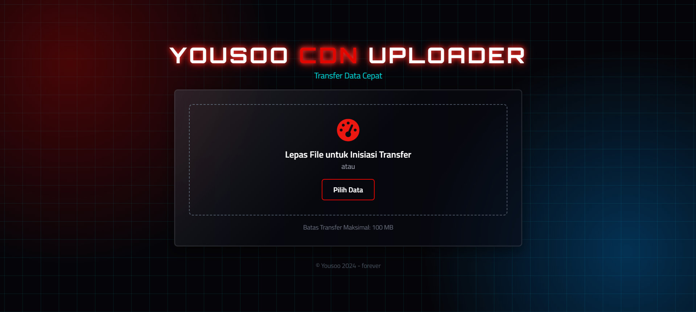

<p align="center">
  
</p>

# 📁 Yousoo CDN Uploader

**Transfer data cepat dengan tampilan futuristik.**  
Proyek ini adalah web uploader sederhana berbasis Node.js + Express + HTML/CSS custom, dengan sistem drag & drop, batasan ukuran file, dan gaya antarmuka ala terminal digital masa depan.

---

## 🖼️ Preview

<p align="center">
  
</p>

---

## ✨ Fitur

- 🎨 Antarmuka modern dan gelap
- 📤 Drag & drop file untuk upload
- 🧰 Batas maksimum transfer 100MB
- 🚀 Dibangun dengan Node.js dan Express
- 🖼 Desain responsif

---

## 🚀 Cara Menjalankan

Pastikan kamu sudah menginstal **Node.js**.

```bash
git clone https://github.com/Yousoo-so/YousoCdn.git
cd YousoCdn
npm install
node server.js